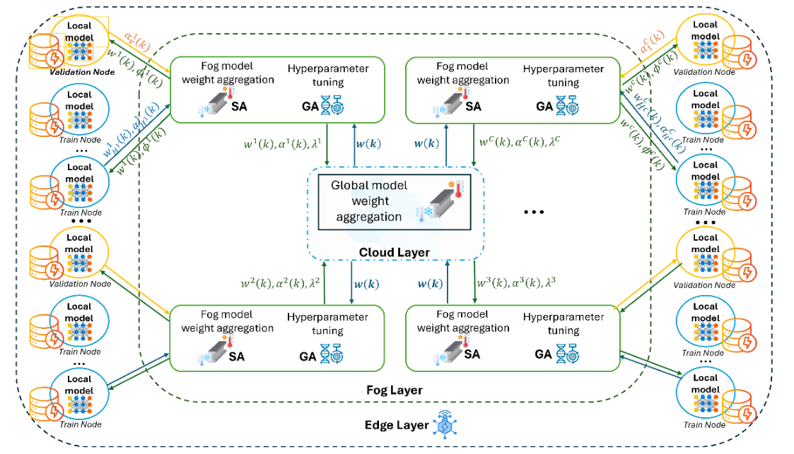
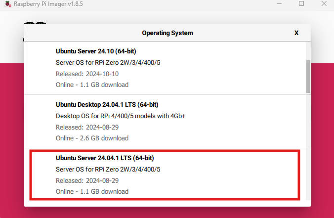
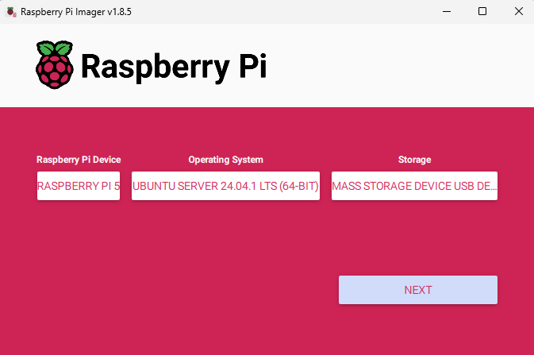
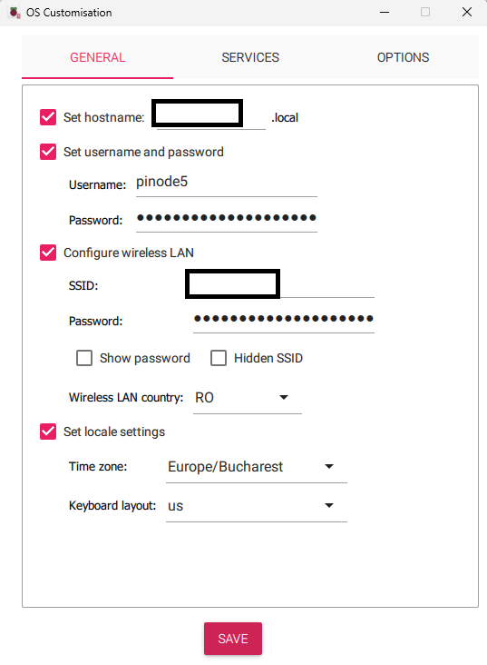
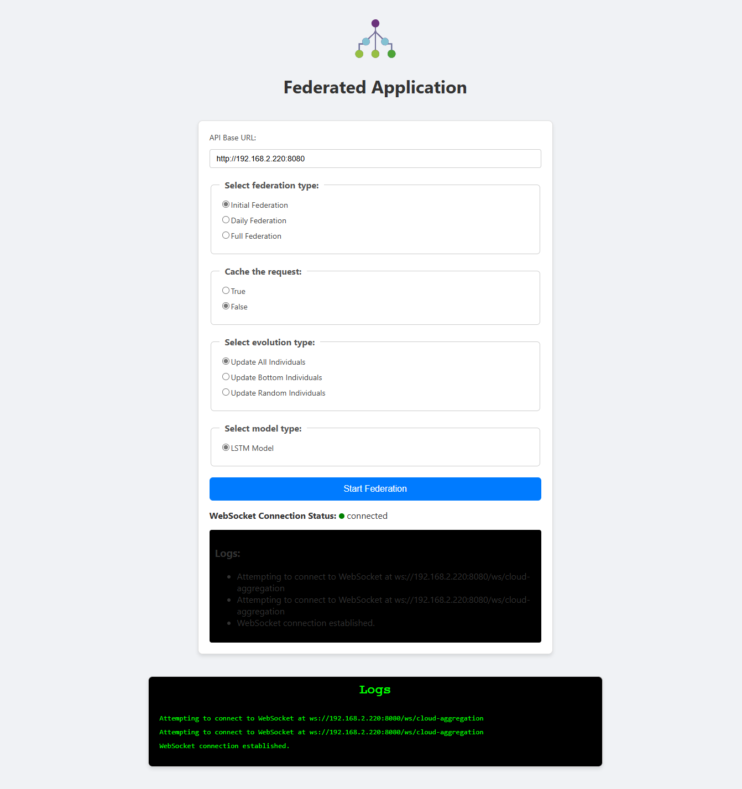

# Heuristic-Adaptive Federated Learning Framework
**README.md writing in working...**

This project aims to create a comprehensive solution for deploying and simulating a Federated Learning network which comes with a novel approach to optimize the model learning process. It is consisting of two main heuristical algorithms, Simulated Annealing and Genetic Algorithm. On one side we create a tailored solution for balancing the exploration/exploation search for performant models while on the training process we are searching at the level of each cluster of clients, training hyper-parameters to ensure a reliable optimization process.

## Table of Contents
- [Overview](#overview)
- [Features](#features)
- [Architecture](#architecture)
- [Technologies Used](#technologies-used)
- [Setup and Installation](#setup-and-installation)
- [Usage](#usage)
- [APIs](#apis)
- [Project Structure](#project-structure)
- [Contributing](#contributing)
- [License](#license)

## Overview
Federated Learning is a distributed machine learning process in which the learning part it is decoupled from a deep large model into multiple smaller collaborating models. Its distributed nature imposes a client-server approach in which there would be several clients holding the private data and one or more servers which would aggregate the resulting models and share them back again for retraining. 

In our solution we are using a hierarchical topology of the network splitted in 3 layers, Cloud, Fog and Edge and each type of node would have at least one of these roles. Beside this nodes organization, the training process it is designed to explore new solutions(models) or exploit the current one based on the system's temperature, in addition with a fine-tuning process for searching optimal training parameters that provide the right path for model's performance convergence.   

## Features
 - Aggregation of models in 2 stages, at the level of fog and at the level of cloud nodes.
 - Supports LSTM-based Keras models.
 - Provides real-time traffic and performance statistics generation.
 - Implementation of a cooling scheduler to act as a Simulating Annealer in the fog and cloud layers and a genetic engine to be used by fog nodes during hyper-parameters optimization.
 - Modular design for extensibility.
 - Caching model files, training statistics and genetic engine configuration for a training flexibility.

## Architecture
The system follows a cloud-fog-edge hierarchy topology:
1. **Cloud Node** Aggregates models, process performance and other statistics data, orchestrates fog and edge nodes, runs a simulated annealer for providing to fog nodes a temperature-based genetic offsprings evolution.
2. **Fog Node** Intermediate layer for aggregating edge retrained model, orchestrates the evaluation and training edge nodes, runs the simulated annealer for model selection, runs the genetic engine for hyper-parameters optimization.
3. **Edge Node** Generate and (re)trains the local edge models based on the privately stored data.



## Technologies Used
- **Java (Spring Boot)**: Backend framework.
- **Python (Tensorflow):** For model creation, handle and aggregation scripts together with heuristic's components.
- **Docker**: Deploy and containerization.
- **ReactJS**: Frontend managing platform.
- **WebSocket**: Real-time communication between FE and BE.

## Setup and installation
### 1. Clone the repository on you working computer
```
git clone https://github.com/mihaid150/Heuristic-Adaptive-Federated-Learning
```
### 2. Network configuration and prerequisites
As node devices we used Raspberry Pi 5 and Pi 4 (RPI5/RPI4) boards for the edge layer and some InterCore I3 Workstations for fog and cloud layer. The setup could be done fine also on a network with only RPIs boards or only Intel workstations. Next i will present how to install Ubuntu Server on those two types of nodes.

#### 2.1 Installing Ubuntu Server on a Raspberry Pi Node (if the board is not already yet configured)
a. **Download the Rasbperry Pi Imager**:
   - Visit the [official Raspberry Pi page](https://www.raspberrypi.com/software/) and download the latest version of the Raspberry Pi Imager application whether it is for x86 or macOS.
b. **Raspberry Pi Image Configuration**:
   - Insert the board MicroSD card(I recommend to be at least 64 GB for no futher worries) into the working desktop and open the Raspberry Pi Image app. From the menu, select the storage representing the MicroSD Card, the operating system that we will install (Choose OS -> Other general-purpose OS -> Ubuntu) should be an LST server version for stability reasons so I have chose Ubuntu Server 24.04.1 LTS (64-bit). From the Raspberry Pi Device field I have selected Raspberry Pi 5 (4) depending on node, I recommend to be at least RPI4 with at least 4 GB RAM memory.
   - After these 3 fields, you can press NEXT and you will be asked if you want some additional customizations and press on EDIT SETTINGS. In the new opened window, set the hostname, the username(I have followed the format *pinodeX* where X can be an index from the ordering rule, e.g., *pinode5*) and the password, configure also the wireless connection with the SSID and password, I recommend to choose a stable network for connection. Then press to SAVE and press YES 2 times and the MicroSD card formatting should begin. When its ready you can plug the MicroSD card into the RPI.
     
<div style="display: flex; justify-content: space-around; align-items: center;">
  
  
</div>


c. **Insert the MicroSD Card and Boot**:
   - Insert the microSD card into Raspberry Pi, connect it to power, and wait for the device to boot. Make sure to connect also a Monitor to the HDMI port and a USB Keyboard for the initial configuration on the board.
d. **Initial Configuration of the RPI board**:
   - The first step after the RPI has booted would be to login with the before configured credentials and then upddate the software. Note that the command is after the ```~$ ```
```
~$ sudo apt-get update
~$ sudo apt-get upgrade
```
d. **Configure a static IP for the RPI board**:
   - After the update is completed, proceed with the next step to set a static IP address for the board in the current network. By using a static IP we could make easier connections between nodes and hardcode them in the software as the current framework does not have a dinamically implemented discovery of the federated network nodes.
   - Next step is to identify the network configuration file used in Ubuntu by Netplan:
```
~$ sudo ls /etc/netplan/
50-cloud-init.yaml
~$ sudo cat /etc/netplan/50-cloud-init.yaml
network:
    version: 2
    wifis:
        renderer: networkd
        wlan0:
            access-points:
                <your-network-ssid>:
                    password: <password>
            dhcp4: true
            optional: true
  
```
   - Update the ```50-cloud-init.yaml``` file with the following lines in order to set the IP adress of the board static. It was configured to be static both for ethernet and wifi connection. You can set a mapping rule between the index of the board, e.g. 9, and the associated host address, e.g., 192.168.2.229.
```
network:
  version: 2
  renderer: networkd
  ethernets:
    eth0:
      addresses:
        - 192.168.2.229/24
      nameservers:
        addresses:
          - 8.8.8.8
          - 8.8.4.4
      routes:
        - to: 0.0.0.0/0
          via: 192.168.2.1
          metric: 100
      optional: true
  wifis:
    wlan0:
      access-points:
        <your-network-ssid>:
          password: <your-network-password>
      dhcp4: no
      addresses:
        - 192.168.2.229/24
      nameservers:
        addresses:
          - 8.8.8.8
          - 8.8.4.4
      routes:
        - to: 0.0.0.0/0
          via: 192.168.2.1
          metric: 200
      optional: true
```
   - After updating the configuration file do the following command and the network address of your board should be configured static and you can proceed to the next step.
```
~$ sudo netplan apply
```
#### 2.2 Prerequisites

a. **Installing and configuring Docker**:
  - In order to run in a containerized environment our applications for the network nodes, we will have to install and configure Docker as in the following commands.
  - Update the Package Index:
```
~$ sudo apt update
~$ sudo apt upgrade -y
```
  - Install Docker related dependencies:
```
~$ sudo apt install -y ca-certificates curl gnupg lsb-release
```
  - Add Docker's official gpg key:
```
~$ sudo mkdir -p /etc/apt/keyrings
~$ curl -fsSL https://download.docker.com/linux/ubuntu/gpg | sudo gpg --dearmor -o /etc/apt/keyrings/docker.gpg
```
  - Set up the docker repository:
```
~$ echo \
  "deb [arch=$(dpkg --print-architecture) signed-by=/etc/apt/keyrings/docker.gpg] https://download.docker.com/linux/ubuntu \
  $(lsb_release -cs) stable" | sudo tee /etc/apt/sources.list.d/docker.list > /dev/null
```
  - Install the Docker engine:
```
~$ sudo apt update
~$ sudo apt install -y docker-ce docker-ce-cli containerd.io docker-buildx-plugin docker-compose-plugin
```
  - Verify Docker installation:
```
~$  docker --version
```
  - Manage Docker as non-root user:
```
~$ sudo groupadd docker
~$ sudo usermod -aG docker $USER
```
### 2. Prepare the Spring Boot Application and the Backend

As we mentioned earlier, the node backend is based on Java (Spring Boot) and in order to be able to run the application on the Ubuntu server we should compile the app as a .jar file from the Maven menu on the right side of the Intellij window where we would have the option *"install"* and press it. This will generate the java archive file on the *target* folder of the folder. 

The files that you will have to move from your working computer to each node server are: .jar file (e.g., *EdgeNode-1.0-SNAPSHOT.jar *) with the archive of the Spring Boot application, the *Dockerfile* together with the *requirements.txt*, this python scripts folder containing the python files which can be found in the *resources* folder of each Spring Boot app. Besides this, you will have to copy on each edge node the *.csv* file with the private dataset. You can copy all these files either by using the [WinSCP app](https://winscp.net/eng/download.php) or by using the CLI command ```~$ pscp <file_1_path> <file_2_path> ... <file_n_path> <remote_path, e.g., pinode6@192.168.2.226:/tmp>```.

We would also need some additional folders to create on the node server such as *cache_json*  or *logs* and they can be created using the command ```~$ mkdir <folder_path>```. After all required files for the containered app are present on the server, one would need to build the docker image. For the name of the images we followed these 3 names in all nodes: *cloudnode_image*, *fognode_image* and *edgenode_image*. The ```.``` would represent the path of the *Dockerfile*.
```
docker build -t edgenode_image .
```
As the application is updated, therefore also the image, building new images leaves back some dangling images of name *<none>* and we can remove them by their image id.
```
~$ docker images
~$ docker rmi <image_id>
```
A image can be run in order to obtain a container so therefore to run the application inside the docker container:
```
~$ docker run <image_name>
```
To efficientize the process. we configured our RPI boards such that when they have finished the boot proccess, to start the docker container automatically. This can be achieved by building a *daemon systemcl service*. Here we also chosen to name the services as *cloudnode.service*, *fognode.service* and *edgenode.service*.
```
~$ cd /etc/systemd/system
~$ sudo touch <service_name>.service
~$ sudo vim <service_name>.service
```
Next, we will write the service configuration file. For the container names, we selected to be like *cloudnode_container*, *fognode_container* and *edgenode_container*. Sometimes we would like that the logs comming from the container to be saved for later observations after the container has exited so we save the logs in a dedicated file with the date when container has run. For a node like *pinode6*, the configuration looks like:
```
[Unit]
Description=EdgeNode Docker Container
After=docker.service
Requires=docker.service

[Service]
User=pinode6
Restart=always
ExecStart=/bin/bash -c 'mkdir -p /home/pinode6/edgenode/logs && \
    LOG_FILE="/home/pinode6/edgenode/logs/edgenode_container_$(date +%%Y%%m%%d_%%H%%M%%S).log" && \
    /usr/bin/docker run --rm --name edgenode_container \
    -p 8080:8080 \
    -v /home/pinode6/edgenode/cache_json:/app/cache_json \
    -v /home/pinode6/edgenode/evaluation:/app/evaluation \
    edgenode_image > "$LOG_FILE" 2>&1'
ExecStop=/usr/bin/docker stop edgenode_container

[Install]
WantedBy=multi-user.target
```
After saving our configuration file, the next step is to enable the service:
```
~$ sudo systemctl enable <service_name>
```
We can write the service witout the *.service* termination in the command to reference it. And now just start the service
```
~$ sudo systemctl start <service_name>
```
For stopping, restarting or viewing the service status we can type
```
~$ sudo systemctl stop <service_name>
~$ sudo systemctl restart <service_name>
~$ systemctl status <service_name>
```
When a service on a node is running, in order to view from the docker perspective the status and output use
```
~$ docker logs -f <container_name>
```
Sometimes to interact with the container and the files inside it you just type the following command and will be moved into the command line of the container:
```
~$ docker exec -it <container_name> /bin/bash
# <commands inside container cli>
```

## Usage
There are two ways in which we can run the simulation on the federated network: either by calling from an application like Postman the endpoints exposed by the CloudNode, either by lauching the Web App and controlling the simulation from there. In the first case we would have to manually configure the endpoints APIs, while in the case of the application we would just select the options from some fields. The CloudNode is the orchestrator of this process, which can start, coordinate and end the executions of the tasks. 

The options that can be configured are the following ones:
### 1. CloudNode IP Address:
As we have seen in the network configuration section, we have statically assigned the IP of each node to ensure an easier use of the communication between instances. In the basic case, all the nodes have the same private network address, ours being configured to be ```192.168.2.X``` and the cloud node is have the host ```220``` so the cloud IP would results as being ```192.168.2.220```. The backend is communicating via the *http* protocol at the port *8080*. 

### 2. Federation Type:
The training schedule it is composed of two stages, the first being the initial training where we do a pre-training on a period of one year for the model, and the second stage being formed by the sequentially daily retrainings. The user can choose from 3 variants, just an *Initial Federation*, just a *Daily Federation*, or both combined in *Full Federation*.

### 3. Cache the request:
One of the framerwork's feature is to save the model as a file between the traininig stages so that if the application ends intentionally or unintentionally, to be able to reload the model and continue the training. Beside the model file, we can save the trafficand elapsed time measured, and the fitness values and population from the genetic engine to not start from the beginning the fine-tunning process. So it's just a boolean *True* or *False* for this option.

### 5. Training date:
The pre-training period was predefined and established in the application but the daily traininings period can be inputed when a daily or full federation was selected before. T

### 6. Evolution type:
During the evolution process of the genetic engine, the individuals would be updated with mutation and crossover genetic operations. The questions is what proportion of the population would be updated. One strategy, ```Update All Individuals``` would be to apply the operations on all individuals, another ```Update Bottom Individuals``` to apply only on the least fitting individuals from the population that could we consider on the bottom, and the last, ```Update Random Individuals```, to update them in a random manner.

### 7. Model type
This refers to choose which model to use in the training or better saying what architecture to use because every model can be a combination of layers and parameters. The current one is ```LSTM Model``` but you can update it to come with new architectures or models.

When all the fields have been completed, one could press the *Start Federation* button and the request with the created endpoint will be send to cloud node which will initiate the simulation. We are also using a websocket to retrieve the status and the logs of the simulation in the dedicated windows below the button. 



## APIs
### CloudNode APIs
This section is more oriented for Postman usage of the framework. To the following apis, do not forget to add the network address of the cloud, ours being ```https://192.168.2.220:8080```:

| Endpoint                                                                        | Method | Description                                         |
|---------------------------------------------------------------------------------|--------|-----------------------------------------------------|
| `/cloud/init/{isCacheActive}/{geneticEvaluationStrategy}/{modelType}`           | POST   | Run the initial iteration of pre-training.          |
| `/cloud/daily-federation/{isCacheActive}/{date}/   {geneticEvaluationStrategy}`    | POST   | Run the daily iteration of pre-training.            |
| `/cloud/elapsed-time-chart`                                                     | POST   | Create a chart with the time elapsed per iteration. |
| `/cloud/create-traffic-chart`                                                   | POST   | Create a chart with the traffic across nodes.       |
| `/cloud/create-performance-chart`                                               | POST   | Create a chart with the performance of global model.|

**README.md writing in working...**
